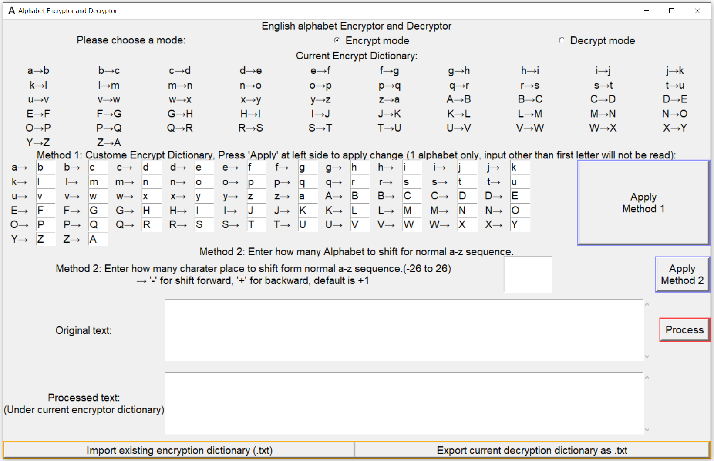
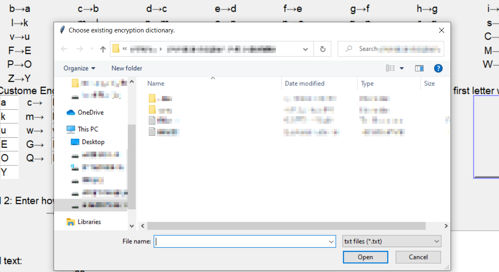
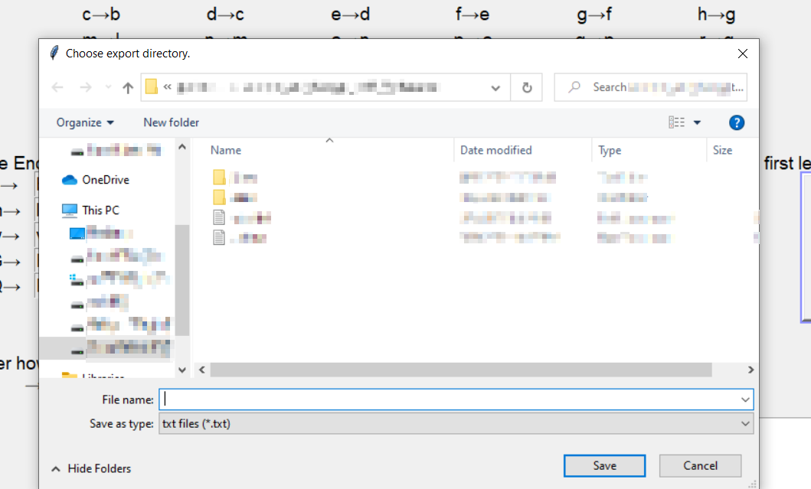
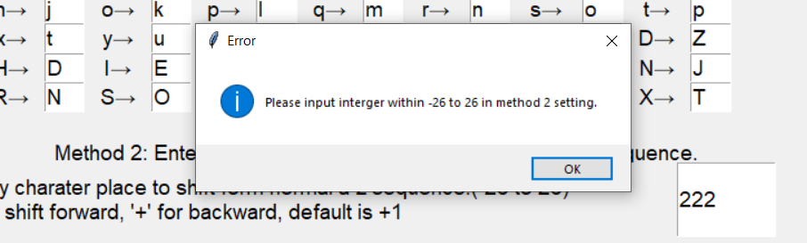
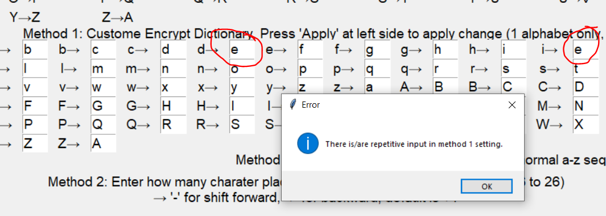

# customizable-alphabet-encoder-decoder-with-tkinter-GUI-and-dictionary-import-export-function

*customizable alphabet encoder and decoder with tkinter GUI v1.0* 
## Index 
### [Introduction](#intro)
### [How to use](#use)
### [Dictionary import and export system](#im-export)
### [Error detection](#error)
### [System Requirement](#requirement)

<h3 id="intro"> Introduction</h3>

This a customizable alphabet letter encoder and decoder with the addition of en/decryption dictionary import/export function.  Written in python 3.7.3 with Tkinter GUI.   

This program works in the way by using dictionary to convert each alphabet (case sensitive) in original text to specified one. This program only converts english alphabet letter, other content such as number, symbol will not be converted.    

Below is the program GUI layout, all GUI scale will auto-resize with programe window size.

<h3 id="use"> How to use</h3>

Run main.py to open the program

User can choose to use encrypt mode or decrypt mode in the radiobutton at the top of the program.    

In the section of "Current encrypt dictionary" shows the current dictionary using, all text will be encrypted according to this dictionary in encrypt mode. 
In decrypt mode, the dictionary's key and value will be reversed inside the program to form decrypt dictionary, it will not be shown in the section of "Current encrypt dictionary". The decrypt dictionary will use to decrypt the encrypted text to plain text.    

Enter plain text in encrypt mode or cipher text in decrypt mode inside input box near "original text". Then press "Process" button inside the red square, plain text will be encrypted into cipher text in encrypt mode while cipher text will be decrypt into plain text in decrypt mode. All result will be output in text box near "Processed text".   

Press right click or use shortcut key to choose cut(Ctrl+x), copy(Ctrl+c) or paste(Ctrl+v) inside any input/output box to do respective function on the highlighted text. Please also reminded scroll bar will be appear in that two text box near "origin text" and "processed text" respectively if the number of words excessed the space, use scrollwheel to scroll up and down or drag the scrollbar directly.  

There are 3 method to customize the encrypt dictionary: two default method and user import encrypt dictionary.  
Method 1 allows user to customize which character will each alphabet transfer to. To do that, change each input box in method 1 section respective to each alphabet. Afterthat, press "Apply Method 1" button to apply the change, a success change will be shown in section:"Current Encrypt Dictionary".   

Please be reminded that only first character inside each input box will be read, all extra input except first character will be removed after pressing "Apply Method 1". 
All invaild input in method 1 like repeated character(s), non alphabet input etc. will cause error. In such case, a error windows pops out with pointing out the error, and the invalid input will not applied to the encrypt dictionary which will remaion as it is. For details, please refer to section [Error detection](#error).  

Method 2 allows user to customize the dictionary by indicating how many alphabet to shift, "+" for shift forward and "-" for shift backward. For examples +1 with change a:a, b:b, c:c... to  a:b, b:c, c:d..., while -1 will change to a:z, b:a, c:b... Default dictionary is +1. "+" sign is not necessary to type  
All change applied successfully will be appear in section:"Current Encrypt Dictionary".  

Method 2 only accept value from -26 to 26, other value than these will resulting error message pop up and no change will be applied to encrypt dictionary. For details, please refer to section [Error detection system](#error)  

<h3 id="im-export"> Dictionary import and export system</h3>

User can import or export the current dictionary by clicking "import existing encryption dictionary(.txt)" or "export existing decryption dictionary as .txt" respectively, after clicked the buttons mentioned, a window will pop out and ask use to choose a location and file name to export or location to import the file, see below pictures. The supportted format in export and import mode is .txt only. User can customerize the dictionary txt file exported and import it again.  

Import window: 
 
Export window: 
 

All invalid data in the imported file, or no file choosed to import or export will resulting an error massage, with the suspension of the im/export process, please redo the process if such error massage occur, for details, please refer to section [Error detection](#error).  

<h3 id="error"> Error detection </h3>

This program can detect different input/export/import errors.  

**If error occured, the current command given by the user will be stopped. Not change/decryption/encryption will be made** 
**Only one error will be showed in a single time**  

The error detection in method 2 can determinate if the input is within -26 to 26. In the case of outranged input, error messagebox "Please input interger within -26 to 26 in method 2 setting." will pop up. While in case of non interger input, error messagebox "Please input '+' or '-' interger only in method 2 setting." will pop up. See below picture: 
 

On the other hand, the errors in method 1 were assigned a value in *error_code*  inside the program. The *error_code* was returned by function *check_if_valid_method_1()* with "False". If every input is ok, *check_if_valid_method_1()* return True and *error_code* has no use.  
*error_code*  1-3 is for method 1's errors, a respective massagebox pops up with details if exact error(s) present. See belows table and example of pop-up massagebox:  
 
| *error_code*  | details |
| ------------- | ------------- |
| 1  | There is/are null input in method 1 setting. |
| 2  | There is/are repetitive input in method 1 setting. |
| 3  | There is/are non-alpha letter input in method 1 setting.|
 
Other unknown error(s) in method 1 will resulting a pop-up messagebox error with "There is/are invalid input(s) in method 1 setting."

  

In the same way but assessed by *check_if_valid_import()*, all data from imported .txt will first check by this function. *check_if_valid_import()* will return true for valid data, false for invalid data with *error_code*. *error_code* 4-9 is used for the case of invalid input, see below table: 

| *error_code*  | details |
| ------------- | ------------- |
| 4  | There is/are null data in import .txt. |
| 5  | There is/are repetitive data (dictionary value) in import .txt. |
| 6  | There is/are non-alpha letter input in import .txt.  |
| 7  | There is/are repetitive data (dictionary key) in import .txt.  |
| 8  | abandoned |
| 9  | Same as error_code 7.  | 

A similiar error messagebox like the one in method 1 will pop up respective to the error.  
If imported file is not a 52 lenght dictionary, "Error", "There dictionary in import .txt has bad format." will be given. 
In case of no file confirmed to import, pop-up massagebox, "error", "There is/are invalid data in import .txt. or import cancelled." will be given. 
Other unknown error(s) will resulting same pop-up messagebox error with "There is/are invalid data in import .txt. or import cancelled.".  

<h3 id="requirement"> System Requirement</h3>
Monitor mininium support 1300x810  
Python installed, recommanded 3.7.3 

